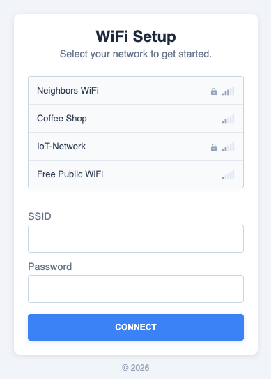

# ESP-IDF WiFi Provisioner

An ESP-IDF component that provides automatic WiFi connection management with a captive portal fallback.

<p align="center">
  
</p>

## How It Works

1. **Boot** — The device reads stored WiFi credentials from NVS (non-volatile storage).
2. **Connect** — If credentials exist, it attempts to connect as a station (STA).
3. **Fallback** — If the connection fails (or no credentials are stored), the device starts a soft-AP with a captive portal.
4. **Configure** — The user connects to the AP, gets redirected to a web page, selects a network, and enters the password.
5. **Save & Reboot** — Credentials are saved to NVS and the device connects to the configured network.

## Features

- Automatic STA connection from stored credentials
- Configurable soft-AP (SSID, password, channel)
- Captive portal with DNS redirect
- Built-in HTTP server for WiFi configuration
- Network scan with signal strength display
- NVS-backed credential storage
- Timeout support (return to normal operation if no client configures the device)
- Event callbacks for application integration

## Requirements

- ESP-IDF v5.0 or later
- ESP32, ESP32-S2, ESP32-S3, ESP32-C3, or ESP32-C6

## Installation

### ESP Component Registry

```bash
idf.py add-dependency "MichMich/esp-idf-wifi-provisioner"
```

### Manual

Clone this repository into your project's `components/` directory:

```bash
cd your-project/components
git clone https://github.com/MichMich/esp-idf-wifi-provisioner.git
```

## Quick Start

```c
#include "wifi_provisioner.h"

void app_main(void)
{
    // Configure and start the provisioner
    wifi_prov_config_t config = WIFI_PROV_DEFAULT_CONFIG();
    config.ap_ssid = "MyDevice-Setup";

    ESP_ERROR_CHECK(wifi_prov_start(&config));

    // Block until connected (or use the event callback for non-blocking)
    wifi_prov_wait_for_connection(portMAX_DELAY);
}
```

## Configuration

Use `idf.py menuconfig` under **Component config > WiFi Provisioner** to set defaults:

- AP SSID / password
- Connection timeout
- Maximum STA retry count
- Portal HTTP port
- Page title, portal header/subheader, connected header/subheader, footer

Or configure at runtime via `wifi_prov_config_t`:

```c
wifi_prov_config_t config = WIFI_PROV_DEFAULT_CONFIG();
config.ap_ssid       = "MyDevice-Setup";
config.ap_password    = "";            // open AP
config.max_retries    = 5;
config.portal_timeout = 180;           // seconds, 0 = no timeout
config.on_connected   = my_connected_cb;
config.on_portal_start = my_portal_cb;

// Customise page text (HTML entities supported)
config.page_title          = "Device Setup";
config.portal_header       = "Connect to WiFi";
config.portal_subheader    = "Select your network below.";
config.connected_header    = "Done!";
config.connected_subheader = "Your device is now connected.";
config.page_footer         = "&copy; 2026 My Company";
```

## API Reference

| Function | Description |
|---|---|
| `wifi_prov_init()` | Initialise NVS, netif and the default event loop (called automatically) |
| `wifi_prov_start(config)` | Start the connect-or-provision flow |
| `wifi_prov_stop()` | Tear down AP, HTTP server, and DNS server |
| `wifi_prov_wait_for_connection(timeout)` | Block until STA is connected |
| `wifi_prov_erase_credentials()` | Clear stored SSID/password from NVS |
| `wifi_prov_is_connected()` | Returns `true` if STA is connected |
| `wifi_prov_get_ip_info(ip_info)` | Get current STA IP address info |

## Project Structure

```
esp-idf-wifi-provisioner/
  CMakeLists.txt            Component build file
  Kconfig                   Menuconfig options
  idf_component.yml         Component registry manifest
  include/
    wifi_provisioner.h      Public API
  src/
    wifi_provisioner.c      Main orchestration (boot flow)
    wifi_sta.c              Station connect / retry logic
    wifi_ap.c               Soft-AP setup
    http_server.c           Captive portal web server
    dns_server.c            DNS redirect for captive portal
    nvs_store.c             NVS read/write helpers
    html/
      portal.html           Captive portal page
  docs/
    example.png             Screenshot for README
  examples/
    basic/                  Minimal usage example
```

## License

GNU General Public License v3.0. See [LICENSE](LICENSE) for details.
